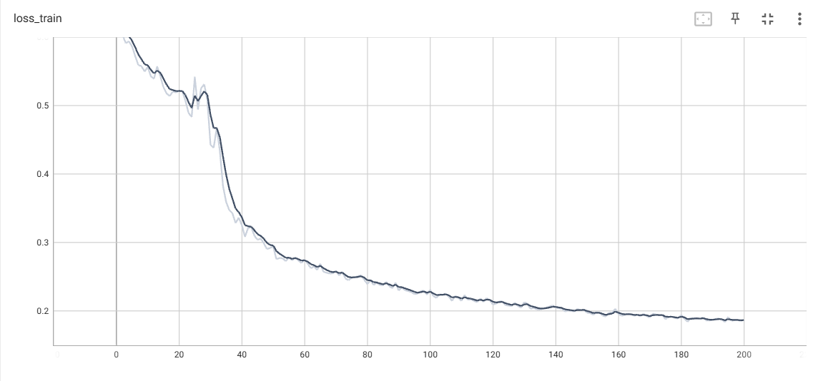
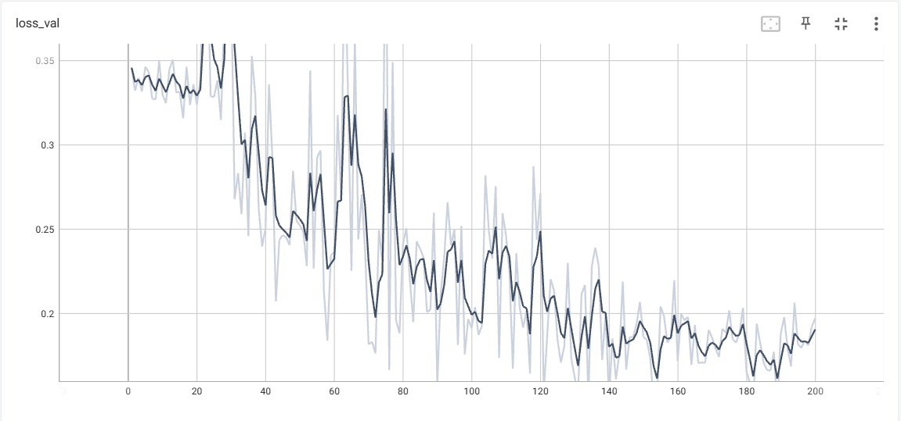

# CPANet-Jittor (Jittor Implementation of [CPANet](https://ieeexplore.ieee.org/document/10049179))

[](https://cg.cs.tsinghua.edu.cn/jittor/)

## 目录
- [环境配置](#环境配置)
- [数据集FSSD-12](#数据集FSSD-12)
- [训练与测试](#训练与测试)
- [基准实验](#基准实验)
  - [Backbone对比实验](#backbone对比实验)
  -  [loss曲线](#loss曲线)
- [消融实验](#消融实验)
- [模型训练参数](#模型训练参数)
- [源码错误与问题](#源码错误与问题)
- [复现过程中Jittor框架的bug和与PyTorch关键区别](#复现过程中Jittor框架的bug和与PyTorch关键区别)
- [总结](#总结)

## 环境配置

```yaml
GPU: NVIDIA GeForce RTX 3050 Laptop GPU (4 GB)
CPU: 11th Gen Intel(R) Core(TM) i5-11260H @ 2.60GHz 2.61GHz
Python: 3.8.20
CUDA: 11.2  
Jittor: 1.3.1.18
```

---
## 数据集FSSD-12
### 数据下载
- 数据集FSSD-12： [https://pan.baidu.com/s/1_BORNJrO4msD0OPEcVSc-Q?pwd=9m10](https://pan.baidu.com/s/1_BORNJrO4msD0OPEcVSc-Q?pwd=9m10)提取码: `9m10`
- 
### 数据划分
| Fold | 缺陷类别 |
|------|----------|
| 0    | abrasion-mask, iron-sheet-ash, liquid, oxide-scale |
| 1    | oil-spot, water-spot, patch, punching |
| 2    | red-iron-sheet, scratch, roll-printing, inclusion |

```text
  ├──CPANet/
  └──FSSD-12/
	  ├── Steel_Am/
	  |   	├── GT/
	  |   	├── Images/
	  |   	└── Nd/
	  ├── Steel_la/
	  ├── Steel_Ld/
	  ├── Steel_Op/
	  ├── Steel_Os/
	  ├── Steel_Pa/
	  ├── Steel_Pk/
	  ├── Steel_Ri/
	  ├── Steel_Rp/
	  ├── Steel_Sc/
	  ├── Steel_Se/
	  └── Steel_Ws/
```

---

## 训练与测试
```bash
python train.py --config config/SSD/fold0_vgg16.yaml
python train.py --config config/SSD/fold0_resnet50.yaml
```

---
## 基准实验

### 注意事项

1. **实验资源限制**  
   由于计算资源和时间有限，本实验及后续部分实验仅在 **1-shot 的 Fold-0** 配置下进行，未能全面覆盖所有 folds 和多种 shot 设置。
2. **模型测试结果存在波动**  
   实验过程中发现模型测试结果存在一定波动，并非完全稳定。例如，在 **VGG-16 - Fold0** 实验中，`mIoU` 测试结果在多次运行中会浮动于 **0.4978 ~ 0.5214** 区间之间（该范围为多次实验测试所得的上下界）。因此，部分指标结果可能略有偏差。
3. **关于 Backbone  预训练参数**  
   由于原论文未公开其 ResNet 变体的预训练模型参数，所以表格中所列的 **ResNet-50** 实验结果基于 **ImageNet 上的标准预训练模型**，并非完全复现原论文配置，故其性能表现可能与原文报告存在一定差异，实验结果仅供参考。
   因此，**本项目后续实验均基于 VGG-16 作为 Backbone 进行展开**。
---

### Backbone对比实验
#### jittor版本
| Backbone | Method | MIoU (1-shot) | FB-IoU (1-shot) |
|----------|--------|---------------|-----------------|
| VGG-16    | Ours   | 52.14         | 70.63            |
| ResNet-50 | Ours   | 58.07         | 74.42            |
#### pytorch版本（原论文）
| Backbone | Method | MIoU (1-shot) | FB-IoU (1-shot) |
|----------|--------|---------------|-----------------|
| VGG-16    | Ours   | 50.8         | 69.1            |
| ResNet-50 | Ours   | 66.0         | 76.1           |
---
### loss曲线
本部分展示了以 **VGG-16** 作为主干网络（Backbone）在 **Fold 0** 条件下训练和测试过程中记录的 **Loss 曲线**，用于直观观察模型的收敛情况和性能变化。

- **训练集 Loss 曲线：**  
  

- **验证集 Loss 曲线：**  
  

---
## 消融实验
## 模块间组件分析（基于 VGG-16）

本部分展示了在以 **VGG-16** 为主干网络的前提下，对模型中的关键模块（CPP、SA、SSA）进行组件级别的消融实验。

### 实验设定

- **Baseline 设置：**  
  - 未使用 CPP 模块，而是采用**掩码全局平均池化**（Masked GAP）提取缺陷前景信息；
  - 移除了**SA 模块**；
  - 解码器由**全卷积解码器**替代了原有的**空间挤压注意力SSA**。

- **实验方式：**  
  仅展示 **1-shot** 下的模型性能，指标包括 `Mean IoU (MIoU)` 和 `Foreground-Background IoU (FB-IoU)`。
 ---

### 模块消融实验结果（1-Shot）
#### jittor版本（VGG-16）
| CPP | SA  | SSA | MIoU(1-shot) | FB-IoU(1-shot) |
|:----:|:----:|:----:|:------------:|:--------:|
| ✗   | ✗   | ✗   | 48.73        | 68.96    |
| ✓   | ✗   | ✗   | 46.20        | 66.84    |
| ✓   | ✓   | ✗   | 46.84        | 67.23    |
| ✗   | ✗   | ✓   | 51.36        | 70.28    |
| ✓   | ✓   | ✓   | **52.14**    | **70.63** |

#### pytorch版本（原论文ResNet-50）
| CPP | SA  | SSA | MIoU(1-shot) | FB-IoU(1-shot) |
|:----:|:----:|:----:|:------------:|:--------:|
| ✗   | ✗   | ✗   | 57.7        | 71.4    |
| ✓   | ✗   | ✗   | 58.3        | 72.6    |
| ✓   | ✓   | ✗   | 65.8        | 75.9    |
| ✗   | ✗   | ✓   | 59.3        | 71.9    |
| ✓   | ✓   | ✓   | **66.0**    | **76.1** |

>  **说明：**
> - `✓` 表示该模块被启用，`✗` 表示未启用；
---

## 辅助 Loss 超参数 k 的选择（基于 VGG-16）

模型的总损失函数由两个独立的损失项线性组合而成，其中超参数 $k$ 控制辅助损失（SA分支）的权重。为确定最佳的超参数设置，我们在 $k \in \{0, 0.2, 0.4, 0.6, 0.8, 1.0\}$ 范围内进行了消融实验。

> 当 $k=0$ 时，SA 分支将完全失效，相当于移除辅助损失路径。

### 不同 k 值下的模型性能（1-Shot）
#### jittor版本（VGG-16）
| k   | MIoU(1-shot) | FB-IoU(1-shot) |
|:---:|:------------:|:--------:|
| 0.0 | 44.20        | 67.24    |
| 0.2 | 48.79        | 69.92|
| 0.4 | **52.14**    | 70.63    |
| 0.6 | 50.39        | **72.2**    |
| 0.8 | 49.39        | 69.93   |
| 1.0 | 48.28        | 69.79   |
#### pytorch版本（原论文ResNet-50）
| k   | MIoU(1-shot) | FB-IoU(1-shot) |
|:---:|:------------:|:--------:|
| 0.0 | 61.8        | 72.9    |
| 0.2 | 65.2        | 74.8|
| 0.4 | **66.0**    | **76.1** |
| 0.6 | 63.4        | 74.8    |
| 0.8 | 62.8        | 74.5   |
| 1.0 | 63.8        | 74.7   |
---

## 模型训练参数
本项目中得到的所有模型训练参数，包括基准实验与消融实验，均已整理完毕。您可通过以下链接查看并下载。
- 训练参数：[https://pan.baidu.com/s/1ZgsZIOBtLWlP2s3bvI51IQ](https://pan.baidu.com/s/1ZgsZIOBtLWlP2s3bvI51IQ)提取码: `qsbq`
---
## 源码错误与问题

在模型训练与复现过程中，发现原论文所提供源码中存在部分实现错误，可能对训练结果产生一定影响。

在辅助 Loss 的计算部分，循环中虽然累计了所有 `supp_loss` 到 `loss` 中，但 **最终的 `aux_loss` 只使用了最后一次迭代的 `supp_loss`**，而不是整个 `supp_loss` 累加的平均。

```python
if self.training:
    supp_loss_list = []
    loss = 0.
    for i in range(self.shot):
        supp_loss = self.criterion(supp_pred_mask_list[i], gt_list[i].squeeze(1).long())
        loss += supp_loss
    aux_loss = supp_loss / self.shot
    main_loss = self.criterion(query_pred_mask, y.long())
```
---

## 复现过程中Jittor框架的bug和与PyTorch关键区别
在使用 Jittor 框架复现 CPANet 的过程中，发现了一些与 PyTorch 不一致的实现细节与潜在错误。以下内容将逐一介绍这些差异及其对结果的影响，并配以对比代码说明。

---

### 1、`jittor.misc.histc` 源码存在边界处理问题

Jittor 中 `histc` 函数在处理边界值（例如最大值等于 `max` 的情况）时，行为与 PyTorch 不一致。

具体表现为，输入数据 [0, 0, 1, 1, 0, 1, 2, 2, 2]，设置参数 bins=3，min=0，max=2 时，PyTorch 输出为 [3., 3., 3.]，而 Jittor 输出为 [3., 3., 1.]。说明 Jittor 在处理最大边界值 2 时未正确计入直方图中。

#### 问题描述：

- **输入数据**：`[0, 0, 1, 1, 0, 1, 2, 2, 2]`
- **参数设置**：`bins=3`, `min=0`, `max=2`

#### PyTorch 输出：

```python
import torch
data = torch.tensor([0, 0, 1, 1, 0, 1, 2, 2, 2], dtype=torch.float32)
hist = torch.histc(data, bins=3, min=0, max=2)
print(hist)  # tensor([3., 3., 3.])
````

#### Jittor 输出：

```python
import jittor as jt
data = jt.array([0, 0, 1, 1, 0, 1, 2, 2, 2])
hist = jt.misc.histc(data, bins=3, min=0, max=2)
print(hist)  # [3. 3. 1.]
```

 **原因**：Jittor 的实现没有将 `max` 本身计入统计中，导致最后一桶数据缺失。

#### 修改后代码：
```python
def histc(input, bins, min=0., max=0.):  
    if min == 0 and max == 0:  
       min, max = input.min(), input.max()  
    assert min < max  
    bin_length = (max - min) / bins  
    histc = jt.floor((input[jt.logical_and(input >= min, input <= max)] - min) / bin_length)  
    histc = jt.minimum(histc, bins - 1).int().reshape(-1)  # 修正关键行  
    hist = jt.ones_like(histc).float().reindex_reduce("add", [bins, ], ["@e0(i0)"], extras=[histc])  
    if hist.sum() != histc.shape[0]:  
        hist[-1] += 1  
    return hist
```
----------

### 2、`max` 与 `argmax` 返回值结构不同

Jittor 与 PyTorch 在 `max` 和 `argmax` 函数的返回格式上存在明显区别。

####  PyTorch：

```python
import torch

x = torch.tensor([[1.0, 5.0, 3.0]])
value, index = torch.max(x, dim=1)
print(value)  # tensor([5.])
print(index)  # tensor([1])

argmax_index = torch.argmax(x, dim=1)
print(argmax_index)  # tensor([1])
```

#### Jittor：

```python
import jittor as jt

x = jt.array([[1.0, 5.0, 3.0]])
value = jt.max(x, dim=1)
print(value)  # [5.] ← 仅返回值

index, val = jt.argmax(x, dim=1)
print(index)  # [1]
print(val)    # [5.] ← 注意：argmax 返回下标和对应值
```

 **区别总结**：
| 功能        | PyTorch 返回内容        | Jittor 返回内容        |
|-------------|--------------------------|-------------------------|
| `max`       | `(value, index)`         | `value`                |
| `argmax`    | `index`                  | `(index, value)`       |

----------

### 3、Loss 反向传播方式不同

Jittor 中使用 `optimizer.step(loss)`，而不是像 PyTorch 中的 `loss.backward()` 和 `optimizer.step()` 两步式。

#### PyTorch：

```python
loss = criterion(output, target)
optimizer.zero_grad()
loss.backward()
optimizer.step()
```

#### Jittor：

```python
loss = criterion(output, target)
optimizer.step(loss)  # 自动完成 backward + update
```
----------
## 总结

本次实验基于 **Jittor 框架** 复现了 **[CPANet](https://ieeexplore.ieee.org/document/10049179)** 的网络结构。实验过程中，虽然成功实现了 CPANet 的整体网络逻辑和训练流程，但复现效果和原论文仍存在一定的差距。

### 存在问题与挑战
- 对 Jittor 框架的使用尚不够熟练，尤其在某些函数接口与 PyTorch 的差异方面（详见前述差异分析部分）；
- 缺乏原论文中特定 **预训练参数**，本实验采用标准 ResNet-50 权重作为替代，可能影响最终性能；
- 个人能力与调试经验尚显不足，在参数调优、调试策略等方面仍有待提升；
- 模型测试结果存在一定波动。例如，VGG-16 作为 backbone 在 fold-0 上的 mIoU 浮动范围为 `0.4978 ~ 0.5214`，其余 folds 也表现出类似的波动情况。这种不稳定性可能与模型的结构或实现细节有关。

### 收获与成长

- **深入理解了 CPANet 的模块设计思想与代码实现**，对 Few-Shot 分割任务的关键技术有了更深刻认识；
- **掌握了 Jittor 框架的基本用法与模型构建流程**，包括数据加载、模型定义、训练与测试过程；
- 积累了进行复现类研究项目的实践经验，对未来开展深度学习模型设计与复现具有重要指导意义；

---
